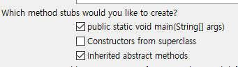

2022년 05월 16일

오늘은 어떤 것들을 보게 되고 궁금하게 될까 ㅎ

1.  늘 궁금했던 거

1\) 객체 생성할 때 new 의 의미

2\) 왜 2번 적을까?

3\) System.in 은 왜 괄호안에 들어가서 입력을 받게 될까?

4\) 디버깅 하는 법

2\. 빠른 입출력을 위해서

bufferedWriter와 Stringbuilder

<https://m.blog.naver.com/ka28/221850826909>

ㄴ 여기서 StringTokenizer 객체 생성할 때 new 문장을 쓰지 않았다. 더
공부를 해봐야 할 듯. -\> 후에 다시 선언함. 흠 readLine이 어ᄄᅠᇂ게
돌아가는걸까\...?

갑자기 반복문 문제를 풀다가 새로운 입출력 방식을 공부해야하다니

이럴거면 이렇게 입출력하는 방법을 입출력 파트에 놓을 것이지 어차피
단계별로 푸는 섹션인데

3\. 이클립스에서 ctrl + shift + O 하면 자동으로 라이브러리 불러와준다.
이클립스 꿀팁 모음집 뒤져봐야겠다.

ctrl + shift + C : 해당 줄 주석처리

ctrl + shift + F : 자동 줄맞춤

4\.

{width="3.55in"
height="1.0083333333333333in"}

매번 클래스만들때마다 클릭하던 이 두 아이의 정체는 무엇일까

5\. 역시 다른 사람들의 코드를 보면 궁금증이 풀린다.

출력문에서 + 를 사용하며 일반 스트링글자와 변수값을 같이적어서 + 기호가
사용될 때 a+b 를 적고싶다면 괄호를 살포시 덮어주자. (a+b)

6\. 나는 반복문 연습문제중에 별이 제일 싫어 ㅠ

아 생각해보니 다른사람 어ᄄᅠᇂ게 풀었을까 본다고 해놓고 또 까먹음 꼭
보자.

7\. 알고리즘 문제풀이를 줄여서 PS라 부르는 모양이다. Problem Solving의
약자인듯한데 나 어디가서 컴공생이였다고는 아직 말하고 다니면 안될거같다.
ㅎㅎ ㅠ

<https://subinium.github.io/how-to-study-problem-solving/>

ㄴ 초중급은 PS를 어떻게 연습하면 좋을까에 대한 글이다.

(아니 근데 EOF 보다가 블로그 글보다가 이렇게 새네 참내)

<https://steady-coding.tistory.com/183>

ㄴ 이분은 ps 풀때는 Scanner 쓰면 안된다구 하신다. 하 슬프다. 익숙해져야
할 거 천지야 ㅠ 그래도 작동되는거 보면 좋아. 변태인가.

8\. EOF는 null 값이 들어가면 아웃이라는 의미라는데 입력받을때 null을
의미하는 값을 넣으려면 어떡해야하는거지?

9\. 일단 오늘은 반복문 문제들을 다 풀고 싶어서 스캐너 사용했는데
내일부터는 버퍼 사용해봐야겠다.

10\. 위에 질문에 대한 정리나 해결을 어찌해야할까.. 그냥 순간에
궁금하기만하고 해결을 한 번이라도 안하면 쓸모없는거같은데 ㅠㅠ 블로그에
그냥 두서없이 정리만 할까?

11\. 복습 개념으로 다음날 전날의 일기를 보면서 필요한 부분들은 블로그에
정리하는 식으로 공부를 시작하는걸로 일단 결정!
